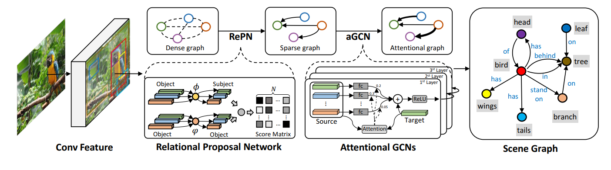
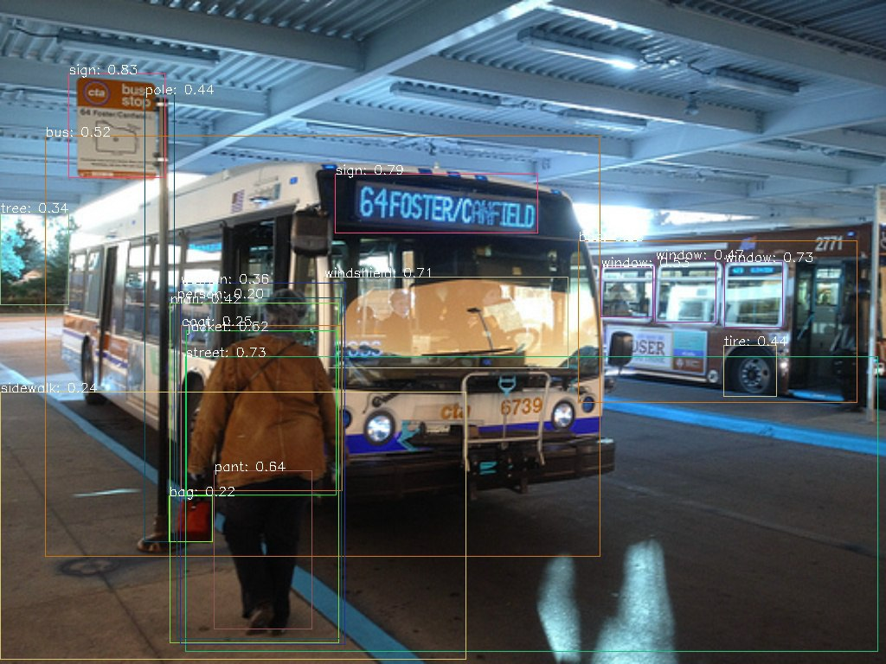
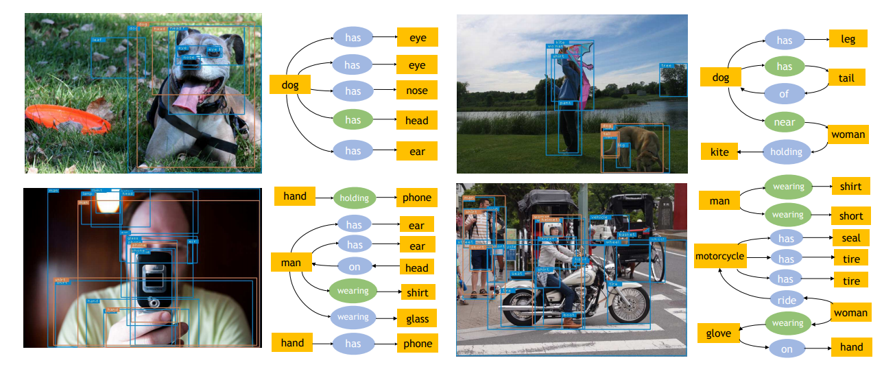

# Graph R-CNN for Scene Graph Generation (ECCV 2018) 

이 페이지는 아래 논문을 리뷰하고 저자의 코드를 분석한 내용을 포함한다.

> Yang, Jianwei, et al. "Graph r-cnn for scene graph generation." *Proceedings of the European conference on computer vision (ECCV)*. 2018.


# Preparation

### Docker

코드를 실행하는데 필요한 툴킷 및 라이브러리등을 설치한 도커 이미지를 dockerhub에 업로드 하였고, 아래 명령어로 pull하여 사용 가능하다.

```
docker pull kbe36/graph-rcnn:v2
```

설치 툴킷 및 cuda 버전

- Python 3.6+
- Pytorch 1.0
- CUDA 8.0+

### Dataset

VisualGenome 데이터셋. 다음 링크를 참고하여 따라 데이터셋을 사용 가능한 형태로 변경 후 아래 경로에 저장한다.

```
datasets/vg_bm/imdb_1024.h5
datasets/vg_bm/bbox_distribution.npy
datasets/vg_bm/proposals.h5
datasets/vg_bm/VG-SGG-dicts.json
datasets/vg_bm/VG-SGG.h5
```


# Run

### Train

객체 검출을 위한 faster-rcnn모델 학습은 아래 명령어로 수행한다.

```
python main.py --config-file configs/faster_rcnn_res101.yaml
```

scene graph generation 모델 학습은 아래 명령어로 수행한다. 이 때 사용하는 faster-rcnn 모델 checkpoint의 경로를 yaml파일에서 지정한다. 

```
python main.py --config-file configs/sgg_res101_step.yaml --algorithm 'sg_grcnn'
```

### Evaluate

Inference는 아래 명령어로 수행한다. 

```
python main.py --config-file configs/sgg_res101_step.yaml --inference --resume $CHECKPOINT
```

89000 step 학습한 checkpoint를 아래 경로에 업로드 하였다.

https://drive.google.com/file/d/1GCWt_uDpr5ySAzTh2TFkF5nu-MrjRCad/view?usp=sharing

다운로드 받은 checkpoint를 아래 경로에 넣고  $CHECKPOINT를 step수에 맞게 설정하여 테스트해 볼 수 있다. 

`checkpoints/vg_benchmark_object/R-101-C4/sg_baseline_relpn_step_2/BatchSize_8/Base_LR_0.005`

> $CHECKPOINT = 0088999


# Analysis of the code


## Model




> GCN_SceneGraph-master > lib > model.py

```
class SceneGraphGeneration:
    def __init__(self, cfg, arguments, local_rank, distributed):
    	...
        # build scene graph generation model
        self.scene_parser = build_scene_parser(cfg); 
   		...
```

model.py에서 모델 initialize, train, 및 test함수를 포함하는 "SceneGraphGeneration" class가 정의된다.  scene 모델을 init하는 부분에 parser 모델을 빌드하는 부분이 있는데 이 모델이 논문의 핵심 내용인 RePN(코드에서는 relpn) 와 aGCN(코드에서는 grcnn) 구조를 포함한다.


> GCN_SceneGraph-master > lib > scene_parser > parser.py

```
class SceneParser(GeneralizedRCNN):
	...
	def forward(self, images, targets=None):
		...
        proposals, proposal_losses = self.rpn(images, features, targets)
		...
        if self.roi_heads:
            x, detections, roi_heads_loss = self.roi_heads(features, proposals, targets)
            ...
            if self.rel_heads:
				...
                x_pairs, detection_pairs, rel_heads_loss = 
                self.rel_heads(relation_features, detections, targets)
                scene_parser_losses.update(rel_heads_loss)

                result = (detections, detection_pairs)
```

전체 프레임워크는 1.객체를 detection하는 fast R-CNN, 2.객체간 관계 스코어를 계산하여 중요한 관계만을 남기고 노드로 생성하는 RePN, 3.객체/관계 노드로 구성된 그래프에서 propagation을 진행하는 aGCN 이렇게 세 단계로 진행된다. parser.py에서 각 단계를 나타내는 모듈간의 입출력을 확인할 수 있다.

- self.rpn : 이미지로부터 객체를 detection하여 proposal을 출력

- self.roi_heads : 객체 proposal들로부터 combination을 만들어 출력

- self.rel_heads : 입력받은 relation(객체의 combination) 중 일부를 pruning하여 relation proposal을 만들고 aGCN을 이용한 propagation을 통해 최종 그래프를 생성

  

> GCN_SceneGraph-master > lib > scene_parser > rcnn > modeling > relation_heads > relation_heads.py
>

```
class ROIRelationHead(torch.nn.Module):
	...
    def __init__(self, cfg, in_channels):
        super(ROIRelationHead, self).__init__()
			...
            self.rel_predictor = build_grcnn_model(cfg, in_channels)
			...
            self.relpn = make_relation_proposal_network(cfg)
            
    def forward(self, features, proposals, targets=None):
		...
        if self.training:
            if self.cfg.MODEL.USE_RELPN:
                proposal_pairs, loss_relpn = self.relpn(proposals, targets)

        if self.cfg.MODEL.USE_FREQ_PRIOR:
			...
        else:
            x, obj_class_logits, pred_class_logits, obj_class_labels, rel_inds =
            self.rel_predictor(features, proposals, proposal_pairs)
		...
		
		if not self.training:
            result = self.post_processor((pred_class_logits), proposal_pairs,
            use_freq_prior=self.cfg.MODEL.USE_FREQ_PRIOR)
            return x, result, {}

        if self.cfg.MODEL.USE_RELPN:
			...
            return (
                x,
                proposal_pairs,
                dict(loss_obj_classifier=loss_obj_classifier,
                     loss_relpn = loss_relpn,
                     loss_pred_classifier=loss_pred_classifier),
            )
```

ROIRelationHead는 모든객체 사이의 relation 중 일부를 pruning하여 relation proposal을 만들고 aGCN을 이용한 propagation을 통해 최종 그래프를 생성하는 class이다.

init 함수를 보면 모델을 구성하는 주요 함수는 "make_relation_proposal_network" 와 "build_grcnn_model" 두 개이다.

forward함수는 training과 test시에 동작하는데, 입력과 출력값은 아래와 같다.

- **input** - <u>features</u> : 노드의 feature-map 

  ​			 <u>proposals</u> : 객체 proposal 

  ​			 <u>targets</u> : ground-truth 타겟

- **output** - <u>x</u>: CNN feature extractor를 이용해 각 object box의 feature를 추출한 값

  ​				<u>proposals</u> : 샘플링된 box proposal 리스트 

  ​				<u>loss</u> : training 프로세스에서 loss값 출력

self.training 태그를 통해 training과 test 프로세스에서 각각 retrun하는 값을 달리 한다.


> GCN_SceneGraph-master > lib > scene_parser > rcnn > modeling > relation_heads > relpn > relpn.py

```
    def _relpnsample_train(self, proposals, targets):
		...
        for img_idx, (proposals_per_image, pos_inds_img, neg_inds_img) in
        enumerate(zip(proposals, sampled_pos_inds, sampled_neg_inds)):
            obj_logits = proposals_per_image.get_field('logits')
            obj_bboxes = proposals_per_image.bbox
            relness = self.relationshipness(obj_logits, obj_bboxes,
            proposals_per_image.size)

            relness_sorted, order = torch.sort(relness.view(-1), descending=True)

            img_sampled_inds =
            order[:self.cfg.MODEL.ROI_RELATION_HEAD.BATCH_SIZE_PER_IMAGE].view(-1)
            proposal_pairs_per_image = proposal_pairs[img_idx][img_sampled_inds]
            proposal_pairs[img_idx] = proposal_pairs_per_image

```

위 코드는 RePN 네트워크에서 relation 후보를 생성하는 부분이 구현된 것이다. 한 이미지에서 모든 객체 pair를 만들고, pair의 relatedness를 계산한 후 연관성이 큰 객체 pair만 남긴다. proposals_per_image가 모든 pair를 나타내는 것이고 self.relationshipness 함수에서는 pair의 두 객체 영역을 각각 kernel function을 통해 projection한 뒤 concat한다. kernel function은 두 층의 MLP로 구성된다. 논문에 해당하는 식은 아래와 같다.


$$ f(p^o_i, p^o_j) = <\phi(p^o_i), \psi(p^o_j)> $$


> GCN_SceneGraph-master > lib > scene_parser > rcnn > modeling > relation_heads > grcnn > grcnn.py

```
class GRCNN(nn.Module):
    def __init__(self, cfg, in_channels):
		...
        if self.feat_update_step > 0:
            self.gcn_collect_feat = _GraphConvolutionLayer_Collect(self.dim, self.dim)
            self.gcn_update_feat = _GraphConvolutionLayer_Update(self.dim, self.dim)
        ...

    def forward(self, features, proposals, proposal_pairs):
		...
        for t in range(self.feat_update_step):
            # message from other objects
            source_obj = self.gcn_collect_feat(obj_feats[t], obj_feats[t], 
            obj_obj_map, 4)

            source_rel_sub = self.gcn_collect_feat(obj_feats[t], pred_feats[t],
            subj_pred_map, 0)
            source_rel_obj = self.gcn_collect_feat(obj_feats[t], pred_feats[t],
            obj_pred_map, 1)
            source2obj_all = (source_obj + source_rel_sub + source_rel_obj) / 3
            obj_feats.append(self.gcn_update_feat(obj_feats[t], source2obj_all, 0))
         ...
```

GRCNN 클래스에는 Graph Convolution 과정이 구현되어있다. _GraphConvolutionLayer_Collect와 _GraphConvolutionLayer_Update는 각각 neighboring 노드로부터 정보를 가져오는 부분과 업데이트 하는 부분이다. forward 함수의 aggregation 부분에서는 모든 엣지 종류로부터 정보를 collect 한다 (source_rel_sub, source_rel_obj, source2obj_all ).

$$z^o_i = \sigma(W^{skip}Z^o\alpha^{skip}+W^{sr}Z^r\alpha^{sr}+W^{or}Z^r\alpha^{or}  ) \quad \quad (8)$$

$$z^r_i = \sigma(z^r_i + W^{rs}Z^o\alpha^{rs}+W^{ro}Z^o\alpha^{ro}  )  \quad \quad (9)$$


> GCN_SceneGraph-master > lib > scene_parser > rcnn > modeling > relation_heads > grcnn > grcnn.py

```
class _Collection_Unit(nn.Module):
    def forward(self, target, source, attention_base):
        fc_out = F.relu(self.fc(source))
        collect = torch.mm(attention_base, fc_out)  # Nobj x Nrel Nrel x dim
        collect_avg = collect / (attention_base.sum(1).view(collect.size(0), 1) + 1e-7)
        return collect_avg
        
class _Update_Unit(nn.Module):
    def forward(self, target, source):
        assert target.size() == source.size(), 
        update = target + source
        return update
        
class _GraphConvolutionLayer_Collect(nn.Module):
    def __init__(self, dim_obj, dim_rel):
        super(_GraphConvolutionLayer_Collect, self).__init__()
        self.collect_units = nn.ModuleList()
        self.collect_units.append(_Collection_Unit(dim_rel, dim_obj))
        self.collect_units.append(_Collection_Unit(dim_rel, dim_obj)) 
        self.collect_units.append(_Collection_Unit(dim_obj, dim_rel)) 
        self.collect_units.append(_Collection_Unit(dim_obj, dim_rel)) 
        self.collect_units.append(_Collection_Unit(dim_obj, dim_obj)) 
        
    def forward(self, target, source, attention, unit_id):
        collection = self.collect_units[unit_id](target, source, attention)
        return collection

class _GraphConvolutionLayer_Update(nn.Module):
    def __init__(self, dim_obj, dim_rel):
        super(_GraphConvolutionLayer_Update, self).__init__()
        self.update_units = nn.ModuleList()
        self.update_units.append(_Update_Unit(dim_obj)) # obj from others
        self.update_units.append(_Update_Unit(dim_rel)) # rel from others

    def forward(self, target, source, unit_id):
        update = self.update_units[unit_id](target, source)
        return update
```

_GraphConvolutionLayer_Collect에서는 주변 노드의 엣지로부터 정보를 가져온다. 모든 종류의 엣지에 대응하기 위해 self.collect_units를 5가지 종류 엣지에 대한 리스트로 만들고 unit_id를 통해 엣지 종류가 지정되면 해당 인덱스의 식을 사용하도록 하였다. _Collection_Unit 에 fully connected layer와 relu function을 거친 후 attention을 곱하고 normalize하는 과정이 구현되어있다. _GraphConvolutionLayer_Update에서는 주변 노드로부터 모은 정보를 타겟 노드에 업데이트한다. _Update_Unit에 타겟과 소스 정보를 합하는 부분이 구현되어 있다.

$$ \bold{z}^{(l+1)}_i = \sigma (WZ^{l}\bold{\alpha}_i) \quad \quad (5) $$

$$ u_{ij} = w^T_h \sigma(W_a[\bold{z}^{(l)}_i, \bold{z}^{(l)}_j]) \quad \quad (6) $$

$$ \bold{\alpha}_i = softmax(\bold{u}_i) \quad \quad (7) $$


## Loss

Loss는 3개의 subprocess로부터 각각 계산된다.

- **P(R, O|V,E,I)** : object classification과 predicate(relation) classification의 multi-class cross entoropy loss

- **P(E|V,I)** : relation proposal들의 binary cross entropy loss

- **P(V|I)** : RPN의 loss ( proposal의 binary cross entropy loss +  anchor의 regression loss)

  

> GCN_SceneGraph-master > lib > scene_parser > parser.py

```
class SceneParser(GeneralizedRCNN):
	...
    def forward(self, images, targets=None):
		...
        proposals, proposal_losses = self.rpn(images, features, targets)
        ...
            if self.rel_heads:
            	...
                x_pairs, detection_pairs, rel_heads_loss = 
                self.rel_heads(relation_features, detections, targets)
                scene_parser_losses.update(rel_heads_loss)
                ...
        if self.training:
            losses = {}
            losses.update(scene_parser_losses)
            losses.update(proposal_losses)
            return losses
```

Scene parser에서는 proposal _losses 와 rel_head_loss를 업데이트한다.

proposal_losses = **P(V|I)** 의 loss

rel_head_loss = **P(R, O|V,E,I)** 와 **P(E|V,I)**  의 loss

rel_head_loss의 구성은 아래 파일에서 볼 수 있다.


> GCN_SceneGraph-master > lib > scene_parser > rcnn > modeling > relation_heads > relation_heads.py

```
class ROIRelationHead(torch.nn.Module):
    def forward(self, features, proposals, targets=None):
			...
            return (
                x,
                proposal_pairs,
                dict(loss_obj_classifier=loss_obj_classifier,
                     loss_relpn = loss_relpn,
                     loss_pred_classifier=loss_pred_classifier),
            )
```

rel_head_loss는 loss_obj_classifier, loss_relpn, loss_pred_classifier를 포함하며 이 loss들은 각각 다음에 해당한다.

loss_obj_classifier = **P(R, O|V,E,I)** 의 object classification loss

loss_pred_classifier =  **P(R, O|V,E,I)** 의 predicate classification loss

loss_relpn = **P(E|V,I)** 의 loss


## DataLoader

> GCN_SceneGraph-master > lib > model.p

```
class SceneGraphGeneration:
    def __init__(self, cfg, arguments, local_rank, distributed):
    	...
 		# build data loader
            self.data_loader_train = build_data_loader(cfg, split="train", 
            is_distributed=distributed)
            self.data_loader_test = build_data_loader(cfg, split="test", 
            is_distributed=distributed)
   		...
   		
   	def train(self):
		...
        for i, data in enumerate(self.data_loader_train, start_iter):
            imgs, targets, _ = data
        	...
        	
     def test(self, timer=None, visualize=False):
		...
        for i, data in enumerate(self.data_loader_test, 0):
            imgs, targets, image_ids = data
            ...
```

"SceneGraphGeneration" class에서는 data loader를 정의하고 train과 test 부분에서 각 스텝마다 batch size만큼의 데이터를 로드한다.  데이터는 다음과 같이 구성된다.

- "imgs" : 프로세싱할 이미지
- "targets" : 이미지 내의 ground truth 객체박스 
- "image_ids" : 이미지의 데이터 인덱스


## Training 

> GCN_SceneGraph-master > lib > model.py

```
class SceneGraphGeneration:
    def train(self):
		...
        for i, data in enumerate(self.data_loader_train, start_iter):

            loss_dict = self.scene_parser(imgs, targets)
            losses = sum(loss for loss in loss_dict.values())
			...
            self.sp_optimizer.zero_grad()
            losses.backward()
            self.sp_optimizer.step()
			...
            if (i + 1) % self.cfg.SOLVER.CHECKPOINT_PERIOD == 0:
                self.sp_checkpointer.save("checkpoint_{:07d}".format(i), 			
                **self.arguments)
           ...
```

train함수에서는 iteration하면서 매 스텝에서 main 모델인 scene_parser로부터 loss를 출력받아  backpropagation을 하고 optimizer를 통해 weight를 업데이트한다. 그리고 일정 스텝마다 checkpoint를 저장한다.


## Test

> GCN_SceneGraph-master > lib > model.py

```
    def test(self, timer=None, visualize=False):
		...
        for i, data in enumerate(self.data_loader_test, 0):
			...
            with torch.no_grad():
                output = self.scene_parser(imgs)
                if self.cfg.MODEL.RELATION_ON:
                    output, output_pred = output
                    output_pred = [o.to(cpu_device) for o in output_pred]
			...
            results_dict.update(
                {img_id: result for img_id, result in zip(image_ids, output)}
            )
            targets_dict.update(
                {img_id: target for img_id, target in zip(image_ids, targets)}
            )
            if self.cfg.MODEL.RELATION_ON:
                results_pred_dict.update(
                    {img_id: result for img_id, result in zip(image_ids, output_pred)}
                )
			...
		if output_folder:
            torch.save(predictions, os.path.join(output_folder, "predictions.pth"))
            if self.cfg.MODEL.RELATION_ON:
                torch.save(predictions_pred, os.path.join(output_folder, 
                "predictions_pred.pth"))

```

test함수에서는 main 모델인 scene_parser로부터 prediction된 결과를 출력한다. 그리고 테스트 이미지에 대한 결과를 딕셔너리 "result_dict", "target_dict", "results_pred_dict"에 이미지 id를 key로 하고 각 결과를 value값으로 하여 저장한다. 모든 iteration이 끝나면 pth파일로 이 dictionary들을 저장한다.


# Result examples



fast-rcnn을 통해 추출한 객체 박스는 위 그림과 같고, 이 정보는 이미지당 하나의 BoxList로 저장된다.

Predictions :BoxList(num_boxes=40, image_width=1024, image_height=768, mode=xyxy)

이후 객체 노드의 pair를 생성한 뒤 RePN을 통해 pruning한 결과는 아래와 같다.

Predictions_pred : BoxPairList(num_boxes=256, image_width=1024, image_height=768, mode=xyxy)

아래 그림은 논문에서 결과를 도식화 한 그림이다.




# Acknowledgement

이 코드는 논문 저자의 github에 업로드된 implementation을 따른 것이며, 실행이 용이하도록 일부 수정하여 업로드한 것이다. 

논문의 링크와 github페이지는 아래와 같다.

> http://openaccess.thecvf.com/content_ECCV_2018/papers/Jianwei_Yang_Graph_R-CNN_for_ECCV_2018_paper.pdf

> https://github.com/jwyang/graph-rcnn.pytorch

